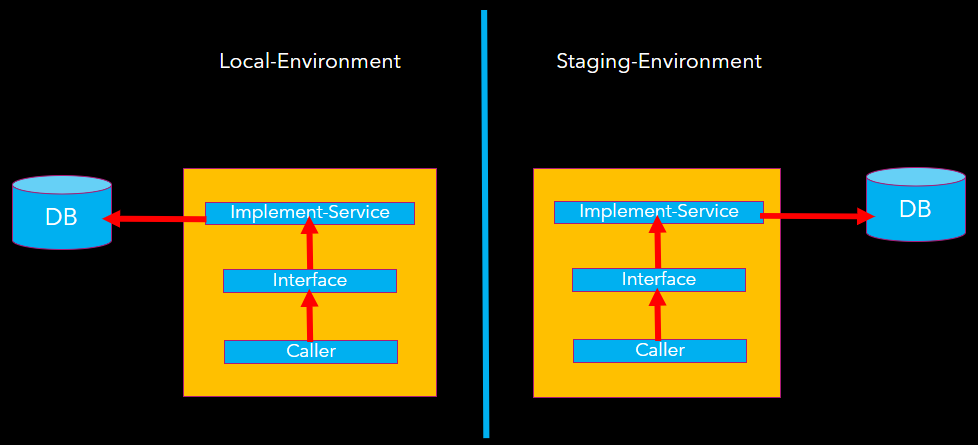
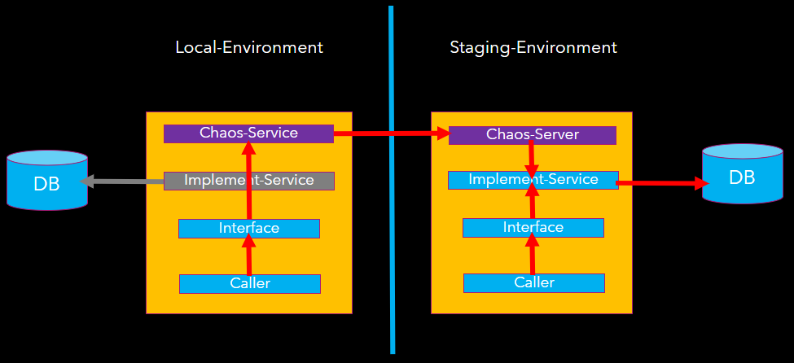

# chaos-service

Chaos strategy is a software development strategy based on the chaos model. Its main rule is to always solve the most important problems first.

The most important issues include the three aspects of big, urgent and strong.

- The big problem provides users with function points.
- Urgent problems need to be solved urgently, otherwise other work may be delayed.
- Strong problems are considered trustworthy after being solved and tested, so that developers can safely look elsewhere.

[](https://youtu.be/L-iCH1w1iKU "FlashElf.ChaosKit")

## Get Packages

You can get FlashElf.ChaosKit by [grabbing the latest NuGet packages](https://www.nuget.org/packages/FlashElf.ChaosKit/). If you're feeling adventurous, continuous integration builds are on MyGet.

## Get Started

Super-duper quick start for aspnet with Autofac:

Register external dependency interface types with a ContainerBuilder and then build the container.

```CSharp
var builder = new ContainerBuilder();
var autofacStarter = new AutofacStarter(builder);

builder.RegisterControllers(Assembly.GetExecutingAssembly());
builder.RegisterType<MyRepo>().As<IMyRepo>();

//Please add the following chaos code after the production code
autofacStarter.AddChaosServices(options=>
{
	options.SetChaosServerIpPort("127.0.0.1:50050");
	options.UseWebSocket();
	//options.UseGrpc();
});
autofacStarter.AddChaosTransient<IMyRepo>();


var container = autofacStarter.Build();

//Start Chaos-Server in Staging-Environment
container.Resolve<IChaosServer>().Start();
```

Super-duper quick start for aspnet core:

Modify Startup.cs and register external dependency interface types with a IServiceCollection.

```CSharp
public void ConfigureServices(IServiceCollection services)
{
	services.AddControllersWithViews();
	services.AddTransient<IMyRepo, MyRepo>();

    //Please add the following chaos code after the production code
	services.AddChaosServices(options => { 
		options.SetChaosServerIpPort("127.0.0.1:50050");
		options.UseWebSocket();
		//options.UseGrpc();
	});
	services.AddChaosTransient<IMyRepo>();
}

public void Configure(IApplicationBuilder app, IWebHostEnvironment env, IChaosServer chaosServer)
{
    if (env.IsDevelopment())
	{
		app.UseDeveloperExceptionPage();
	}

    //Start Chaos-Server in Staging-Environment
    chaosServer.Start();
}
```

## Chaos Mechanism Behind

Generally, Application have Interface and Implement-Service, Caller access the database through the Interface.

```C#
services.AddTransient<IMyRepo, MyRepo>();
```



The following code register chaos-service that
implement Interface (IMyRepo) in local-environment.

```C#
services.AddChaosTransient<IMyRepo>();
```

The following code will start chaos-server in staging-environment.

```C#
chaosServer.Start();
```

In the local environment, the Caller used MyRepo originally.

After the above code, the caller will invoke chao-service that communicate with chaos-server in staging environment.



The chaos-server will invoke implement-service(MyRepo) to access staging data and return to chaos-service.

For the communication method between chaos-service and chaos-server.
We can use following code to use WebSocket protocol.
```
options.UseWebSocket();
```

Or use gRPC protocol.
```
options.UseGrpc();
```

## Advanced use

For existing old projects, some old projects have many existing interfaces.
```C#
services.AddTransient<IMyRepo1, MyRepo1>();
services.AddTransient<IMyRepo2, MyRepo2>();
services.AddTransient<IMyRepo3, MyRepo3>();
...
```

We can add 'ChaosInterface' Attribute code at the interface beginning.
```
[ChaosInterface]
public interface IMyRepo1
{
	...
} 

[ChaosInterface]
public interface IMyRepo2
{
	...
} 
```

Then we use following code to generate Chaos-Service for each interface that attach ChaosInterface attribute automatically.
```C#
services.AddChaosInterfaces(typeof(IMyRepo1).Assembly);
```

Another AddChaosInterfaces method. The following code will search all interfaces that contain 'MyRepo' keyword. 
and generate Chaos-Service automatically.
```C#
services.AddChaosInterfaces(typeof(IMyRepo2).Assembly, interfaceType => interfaceType.Name.EndsWith("MyRepo"));
```

Finally, Happy code to you.
